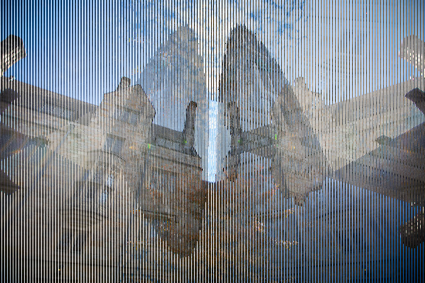
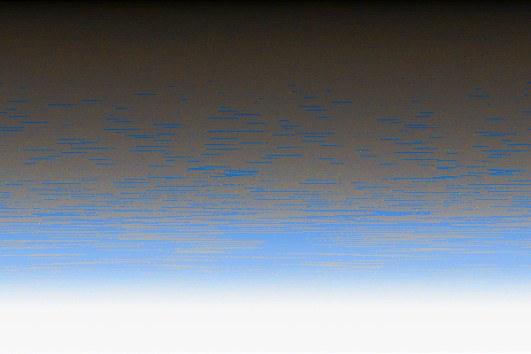

# ImageModifier

Execute "make filter" from project's directory to compile the program.

Once compiled you can run the program with proper parameters
./filter -{function indicator} {input path} {output path}

Example:
 
Original
 

 
 
Ignore Red Channel
 
./filter -1 inputImages/tower.bmp outputImages/1Tower.bmp
would produce;
 

 
 
Ignore Green Channel
 
./filter -2 inputImages/tower.bmp outputImages/2Tower.bmp
would produce;
 

 
 
Ignore Blue Channel
 
./filter -3 inputImages/tower.bmp outputImages/3Tower.bmp
would produce;
 

 
 
Blur
 
./filter -b inputImages/tower.bmp outputImages/bTower.bmp
would produce;
 

 
 
Edge Detection
 
./filter -e inputImages/tower.bmp outputImages/eTower.bmp
would produce;
 

 
 
Grayscale
 
./filter -g inputImages/tower.bmp outputImages/gTower.bmp
would produce;
 

 
 
Reverse
 
./filter -r inputImages/tower.bmp outputImages/rTower.bmp
would produce;
 

 
 
Inverse
 
./filter -i inputImages/tower.bmp outputImages/iTower.bmp
would produce;
 

 
 
Lighten
 
./filter -l inputImages/tower.bmp outputImages/lTower.bmp
would produce;
 

 
 
Fade
 
./filter -f inputImages/tower.bmp outputImages/fTower.bmp
would produce;
 

 
 
Hallucinate
 
./filter -h inputImages/tower.bmp outputImages/hTower.bmp
would produce;
 

 
 
Sort
 
./filter -s inputImages/tower.bmp outputImages/sTower.bmp
would produce;
 
